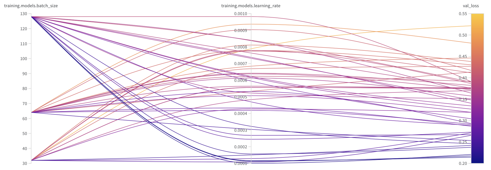

# Exam template for 02476 Machine Learning Operations

This is the report template for the exam. Please only remove the text formatted as with three dashes in front and behind
like:

```--- question 1 fill here ---```

where you instead should add your answers. Any other changes may have unwanted consequences when your report is auto
generated in the end of the course. For questions where you are asked to include images, start by adding the image to
the `figures` subfolder (please only use `.png`, `.jpg` or `.jpeg`) and then add the following code in your answer:

```markdown

```

In addition to this markdown file, we also provide the `report.py` script that provides two utility functions:

Running:

```bash
python report.py html
```

will generate an `.html` page of your report. After deadline for answering this template, we will autoscrape
everything in this `reports` folder and then use this utility to generate an `.html` page that will be your serve
as your final handin.

Running

```bash
python report.py check
```

will check your answers in this template against the constrains listed for each question e.g. is your answer too
short, too long, have you included an image when asked to.

For both functions to work it is important that you do not rename anything. The script have two dependencies that can
be installed with `pip install click markdown`.

## Overall project checklist

The checklist is *exhaustic* which means that it includes everything that you could possible do on the project in
relation the curricilum in this course. Therefore, we do not expect at all that you have checked of all boxes at the
end of the project.

### Week 1

* [x] Create a git repository
* [x] Make sure that all team members have write access to the github repository
* [x] Create a dedicated environment for you project to keep track of your packages
* [x] Create the initial file structure using cookiecutter
* [x] Fill out the `make_dataset.py` file such that it downloads whatever data you need and
* [x] Add a model file and a training script and get that running
* [x] Remember to fill out the `requirements.txt` file with whatever dependencies that you are using
* [x] Remember to comply with good coding practices (`pep8`) while doing the project
* [x] Do a bit of code typing and remember to document essential parts of your code
* [x] Setup version control for your data or part of your data
* [x] Construct one or multiple docker files for your code
* [x] Build the docker files locally and make sure they work as intended
* [x] Write one or multiple configurations files for your experiments
* [x] Used Hydra to load the configurations and manage your hyperparameters
* [ ] When you have something that works somewhat, remember at some point to to some profiling and see if
      you can optimize your code
* [x] Use Weights & Biases to log training progress and other important metrics/artifacts in your code. Additionally,
      consider running a hyperparameter optimization sweep.
* [x] Use Pytorch-lightning (if applicable) to reduce the amount of boilerplate in your code

### Week 2

* [x] Write unit tests related to the data part of your code
* [ ] Write unit tests related to model construction and or model training
* [ ] Calculate the coverage.
* [x] Get some continuous integration running on the github repository
* [x] Create a data storage in GCP Bucket for you data and preferable link this with your data version control setup
* [x] Create a trigger workflow for automatically building your docker images
* [ ] Get your model training in GCP using either the Engine or Vertex AI
* [x] Create a FastAPI application that can do inference using your model
* [ ] If applicable, consider deploying the model locally using torchserve
* [x] Deploy your model in GCP using either Functions or Run as the backend

### Week 3

* [ ] Check how robust your model is towards data drifting
* [x] Setup monitoring for the system telemetry of your deployed model
* [ ] Setup monitoring for the performance of your deployed model
* [x] If applicable, play around with distributed data loading
* [ ] If applicable, play around with distributed model training
* [x] Play around with quantization, compilation and pruning for you trained models to increase inference speed

### Additional

* [x] Revisit your initial project description. Did the project turn out as you wanted?
* [x] Make sure all group members have a understanding about all parts of the project
* [x] Uploaded all your code to github

## Group information

### Question 1
> **Enter the group number you signed up on <learn.inside.dtu.dk>**
>
> Answer:

64

### Question 2
> **Enter the study number for each member in the group**
>
> Example:
>
> *sXXXXXX, sXXXXXX, sXXXXXX*
>
> Answer:

s204102, s204121, s204147, s204111, s204241

### Question 3
> **What framework did you choose to work with and did it help you complete the project?**
> Answer length: 100-200 words.
>
> Example:
> *We used the third-party framework ... in our project. We used functionality ... and functionality ... from the*
> *package to do ... and ... in our project*.
>
> Answer:

We used the third-party framework `timm` in our project. We used the framework's definition of a ResNet-18 model to instantiate a ResNet-18 image classification model, with pretrained weights available to us, which it downloaded from HuggingFace. Since the ResNet-18 was pretrained, in order to use it for a task with 10 classes, the classifier (the last linear layer) of the model was replaced by a linear layer with random weights and 10 outputs. The model is then finetuned, which dramatically reduces training time.

In spite of how nice `timm` is, we, however, also have a simple MLP model that is used for local development purposes. Some of our members do not have access to GPUs so running even a small model like ResNet-18 is prohibitively delaying for them while developing.


## Coding environment

> In the following section we are interested in learning more about you local development environment.

### Question 4

> **Explain how you managed dependencies in your project? Explain the process a new team member would have to go**
> **through to get an exact copy of your environment.**
>
> Answer length: 100-200 words
>
> Example:
> *We used ... for managing our dependencies. The list of dependencies was auto-generated using ... . To get a*
> *complete copy of our development environment, one would have to run the following commands*
>
> Answer:

A new member would follow the installation instructions in the project `README.md` to install the project.
The recommended way is to use devcontainers, this requires the new team member to have `Docker` installed on their system.
If they have a GPU, and they want to accelerate their processing they also need to install NVIDIA's container runtime.
Afterwards they can just open the devcontainer, and the environment will automatically be setup for them.

Unfortunately the containers depend on Linux, so Windows and MacOS users have to run a Linux VM through e.g. WSL,
where the Docker Engine will actually be running. Fortunately Window's WSL integration is, however, mature.

Our project dependencies are tracked via requirements files; we have requirement files for running the project,
and a requirements file for developing on the project. These files are tied to our project via the pyproject file.
These files are maintained manually because in very rare cases `pipreqs` fails.


### Question 5

> **We expect that you initialized your project using the cookiecutter template. Explain the overall structure of your**
> **code. Did you fill out every folder or only a subset?**
>
> Answer length: 100-200 words
>
> Example:
> *From the cookiecutter template we have filled out the ... , ... and ... folder. We have removed the ... folder*
> *because we did not use any ... in our project. We have added an ... folder that contains ... for running our*
> *experiments.*
> Answer:

We have modified the cookiecutter template to have a `src`-based structure instead. This is to separate our source code from the other folders in our project for both clarity and to avoid naming conflicts. We also have two different modules in our project: the ML backend, and the website frontend, which this structure helps to highlight.

[do we expplain our use of devcontainers? - this should probably be done in question 4]
We have added a `.devcontainer` folder for our devcontainer specification to ensure that we all work in the same environment. We have added a `cloudbuilds` folder for integration with GCP cloud builds. We have not used the `docs` and `notebooks` directories, nor the `Makefile`, so these have all been removed. Our `pyproject.toml` has been modified appropriately to enable installation of our project.

Our tests are placed in their associated modules in a `tests` folder. This is to avoid having to duplicate and maintain the source code structure in a separate `tests` folder in the project root directory. PyTest supports this structure with minimal changes to the `pyproject.toml` file.

Our configuration structure is hierarchical in that our global and default configurations are described first, and then subsettings set by config files in directories further down. In our case, we have different configurations depending upon what model type is currently used (ResNet18 vs. Simple MLP).

### Question 6

> **Did you implement any rules for code quality and format? Additionally, explain with your own words why these**
> **concepts matters in larger projects.**
>
> Answer length: 50-100 words.
>
> Answer:

--- question 6 fill here ---
To ensure good code quality and format we have set up pre-commits, github actions as well as used GitHub flow and required peer review before merging into the main branch.
As part of the github actions we verify the format using ruff and run our tests created using pytest. Consistent code improves readability, collaboration, and maintainability in larger projects, and helps reduce the possibility of bugs or issues.


## Version control

> In the following section we are interested in how version control was used in your project during development to
> corporate and increase the quality of your code.

### Question 7

> **How many tests did you implement and what are they testing in your code?**
>
> Answer length: 50-100 words.
>
> Example:
> *In total we have implemented X tests. Primarily we are testing ... and ... as these the most critical parts of our*
> *application but also ... .*
>
> Answer:

Pytest is not a new concept to us and we therefore only develop tests as a proof of concept. We have two tests that together check if the data can be loaded correctly and in the correct format (shape). To challenge ourselves and to not let the tests modify our repository, we use `@pytest.fixture(scope="session")`. We chose to focus our time on getting Google Cloud to work, and therefore our tests are fairly sparse.

### Question 8

> **What is the total code coverage (in percentage) of your code? If you code had an code coverage of 100% (or close**
> **to), would you still trust it to be error free? Explain you reasoning.**
>
> Answer length: 100-200 words.
>
> Example:
> *The total code coverage of code is X%, which includes all our source code. We are far from 100% coverage of our **
> *code and even if we were then...*
>
> Answer:

When using the `coverage` library we get a very high coverage (97%), because the `__name__=="__main__"` statement is never run. This is quite misleading as we are only testing 2 of our scripts. This means that because the other scripts are never run with our pytest, the coverage library does not detect that they contain any statements. If we used the test for anything else than a proof of concept we would have implemented tests to check for training the model, making inference with the model and our webserver, but we instead chose to focus on cloud deployment as this is new to us.

This shows that both having 100% coverage does not mean that the code is error free, as you can obtain a 100% without actually having any tests. Further, if you actually have 100% coverage and you are testing all files this still won't necessarily mean that there are no errors in the code that is tested e.g. a method that can take any iterable might only be tested with lists, and might fail when using numpy arrays which could be done somewhere else in the code.
### Question 9

> **Did you workflow include using branches and pull requests? If yes, explain how. If not, explain how branches and**
> **pull request can help improve version control.**
>
> Answer length: 100-200 words.
>
> Example:
> *We made use of both branches and PRs in our project. In our group, each member had an branch that they worked on in*
> *addition to the main branch. To merge code we ...*
>
> Answer:

The workflow was based upon GitHub Flow, which is a lightweight version of Git flow. This workflow was enforced via settings on GitHub and peer pressure. Every new feature or fix requires the creation of a new branch.
Branch names have the type as a prefix e.g: "feat-" or "fix-". For example, if one were to add wandb logging to the training script, the branch would be named "feat-wand-logging". To merge changes into the main branch, a pull request must be submitted, pass continuous integration, and be approved by at least 1 other member after review.

This workflow keeps the main branch in a working state, such that continuous deployment can be set up to automatically trigger upon changes to the main branch.

### Question 10

> **Did you use DVC for managing data in your project? If yes, then how did it improve your project to have version**
> **control of your data. If no, explain a case where it would be beneficial to have version control of your data.**
>
> Answer length: 100-200 words.
>
> Example:
> *We did make use of DVC in the following way: ... . In the end it helped us in ... for controlling ... part of our*
> *pipeline*
>
> Answer:

--- question 10 fill here ---
We have used DVC to transfer our data and trained models to a GCS Bucket, where object versioning has been activated. It is especially important when dealing with dynamic datasets. Knowing which dataset corresponds to each model aids in understanding performance variations. Additionally, in scenarios where a new model performs worse after deployment, having version control facilitates efficient rollbacks to an old model that behaved better. This capability enhances our ability to identify and address issues fast, contributing to the overall robustness of the project. It also ensures reproducible results.

used it just to transfer data and models to the google cloud storage bucket, but we didn't have different versions of the vod
- if data is changing -> more data along the way, we know which dataset correpsonds to each model.
- when do things break
- in case a new model appears worse once deployed, it allows rollbacks
-

### Question 11

> **Discuss you continues integration setup. What kind of CI are you running (unittesting, linting, etc.)? Do you test**
> **multiple operating systems, python version etc. Do you make use of caching? Feel free to insert a link to one of**
> **your github actions workflow.**
>
> Answer length: 200-300 words.
>
> Example:
> *We have organized our CI into 3 separate files: one for doing ..., one for running ... testing and one for running*
> *... . In particular for our ..., we used ... .An example of a triggered workflow can be seen here: <weblink>*
>
> Answer:

We have pre-commit set up to automatically run fix/detect easily correctable issues such as mixed line ending, unfixed merge conflicts, or staged secrets. Ruff has also been hooked into pre-commit to enforce mild adherence to PEP8 (linting). This has been integrated into the devcontainer to ensure it is run locally before committing.
We also have some unit tests set up via PyTest, which are integrated into our IDEs to enable easy running and checking.

To ensure our checks above are run before changes to the main branch, we also run them via GitHub Actions once code has been pushed. This is useful in cases where someone has somehow messed up their devcontainer, is developing outside the devcontainer, or simply forgot to run pytest.

To speed up our continuous integration, we make use of caching on GitHub Actions to avoid downloading our package requirements repeatedly - this is implemented via the setup-python@v4 workflow, which implements it via a one-liner. We do not test across multiple platforms nor Python versions, because we are not developing a package to be distributed through PyPi. Our applications are deployed via containers to GCP, so our runtime environments are controlled and known. In other words, our package is not inteded for use by different end users on different systems. It is intended as a backend that end users will only ever interact with through an api, and thus we are able to control the environment in which our package will run.

One of our runs can be seen [here](https://github.com/sarphiv/dtu-02476-ml-ops/actions/runs/7555077753)


## Running code and tracking experiments

> In the following section we are interested in learning more about the experimental setup for running your code and
> especially the reproducibility of your experiments.

### Question 12

> **How did you configure experiments? Did you make use of config files? Explain with coding examples of how you would**
> **run a experiment.**
>
> Answer length: 50-100 words.
>
> Example:
> *We used a simple argparser, that worked in the following way: python my_script.py --lr 1e-3 --batch_size 25*
>
> Answer:

--- question 12 fill here ---
We used hydra to organize the configurations in config files in two layers. This allows us to specify which model architecture we want to train on. To run an experiment using the simple mlp model with batch size 200, on would run

`python src/ml_backend/train_model.py training.models=simple_mlp training.models.batch_size=200`

We have used weights and biases to log our experiments. A Weights & Biases sweep can be initialized by:

`wandb sweep configs/sweep.yaml`

We have used docker containers to ensure reproducibility and consistency across different systems and machines.


### Question 13

> **Reproducibility of experiments are important. Related to the last question, how did you secure that no information**
> **is lost when running experiments and that your experiments are reproducible?**
>
> Answer length: 100-200 words.
>
> Example:
> *We made use of config files. Whenever an experiment is run the following happens: ... . To reproduce an experiment*
> *one would have to do ...*
>
> Answer:

--- question 13 fill here ---
We have used containers to ensure reproducibility and consistency across different environments. To secure that no information is lost, and the experiments are reproducible we have made use of config files and used weights and biases for logging (version-controlled configs). The config files also contain which seed has been used in the experiment. Whenever an experiment is run weights and biases creates a folder with files containing the requirements, configs, and model summary. The folders are placed locally and online. By storing it online we ensure that no information is lost. Storing it online using wandb is especially important since the log files not tracked by git. This is because version controlling multiple large files is undesirable, but we still want to store them.

### Question 14

> **Upload 1 to 3 screenshots that show the experiments that you have done in W&B (or another experiment tracking**
> **service of your choice). This may include loss graphs, logged images, hyperparameter sweeps etc. You can take**
> **inspiration from [this figure](figures/examples/wandb.png). Explain what metrics you are tracking and why they are**
> **important.**
>
> Answer length: 200-300 words + 1 to 3 screenshots.
>
> Example:
> *As seen in the first image when have tracked ... and ... which both inform us about ... in our experiments.*
> *As seen in the second image we are also tracking ... and ...*
>
> Answer:

--- question 14 fill here ---




The first two figures display information about a single experiment and the third are produced by a sweep. Figure 1 shows the loss and accuracy graphs for both training and validation for an experiment inside our sweep. It is important to track for both training and validation to ensure that the model does not overfit. We have tracked both accuracy and loss, since accuracy gives a good overview, while loss is used when determining model performance. The table in figure 2 displays a proportion of the config file, that has been logged. The last figure displays a sweep where we have used Bayesian hyperparameter optimization of learning rate and batch size. The objective of the optimization is to minimize the validation loss. The figure shows that the validation loss is low, when the batch size is around 130 and the learning rate is close to 0.0001.

### Question 15

> **Docker is an important tool for creating containerized applications. Explain how you used docker in your**
> **experiments? Include how you would run your docker images and include a link to one of your docker files.**
>
> Answer length: 100-200 words.
>
> Example:
> *For our project we developed several images: one for training, inference and deployment. For example to run the*
> *training docker image: `docker run trainer:latest lr=1e-3 batch_size=64`. Link to docker file: <weblink>*
>
> Answer:

For our training experiments we have a dockerfile made specifically for training. We, however, only used this once, because it was faster and cheaper to train our models locally instead of on GCP Vertex AI. Our experiments have therefore been run directly in our devcontainer, which uses our devcontainer dockerfile.

Our `dev.Dockerfile` simply sets up system packages, a non-root user, and then it caches the package requirements as an image layer. The `devcontainer.json` then sets up the rest of the development tools and settings.

For the inference server to be deployed we have a separate dockerfile. This server is simply run with `docker run -p <host-port>:8080 inference-server:latest`. Our frontend website image is also simply run with `docker run -p <host-port>:80 website:latest`.

- [dev.Dockerfile](https://github.com/sarphiv/dtu-02476-ml-ops/blob/main/dockerfiles/dev.Dockerfile)
- [devcontainer.json](https://github.com/sarphiv/dtu-02476-ml-ops/blob/main/.devcontainer/gpu/devcontainer.json)


### Question 16

> **When running into bugs while trying to run your experiments, how did you perform debugging? Additionally, did you**
> **try to profile your code or do you think it is already perfect?**
>
> Answer length: 100-200 words.
>
> Example:
> *Debugging method was dependent on group member. Some just used ... and others used ... . We did a single profiling*
> *run of our main code at some point that showed ...*
>
> Answer:

As the focus was on CI, CD, and cloud no profiling was done as the code was already fast enough, so it was not a priority.
When we encountered bugs we used the debugger integration in VSCode to debug our application via breakpoints and the debug console.
We also made use of the debugger's ability to attach to running processes such that we could debug the frontend, which was started via uvicorn.
When the cloud builds and/or deployments failed, we investigated the errors via the cloud console logs.
In a few occasions we also gained shell access to running containers such that we could debug file system issues.


## Working in the cloud

> In the following section we would like to know more about your experience when developing in the cloud.

### Question 17

> **List all the GCP services that you made use of in your project and shortly explain what each service does?**
>
> Answer length: 50-200 words.
>
> Example:
> *We used the following two services: Engine and Bucket. Engine is used for... and Bucket is used for...*
>
> Answer:

We store model snapshots and training data in a `GCP Bucket` using dvc.

For deploying the model we have a fully developed continuous deployment pipeline. The backbone consists of two `GCP Trigger`s. They take care of building the images and deploying our inference server and webpage. The triggers first build the images using `GCP Build` and store them in `GCP container registry`. At last we use `GCP Run` to host the server, and it gets access to the `GCP bucket` using an IAM account that has access to viewing all of the data in our bucket. The triggers run every time something is pushed to main branch on GitHub.

We skip Vertex AI for model training due to the simplicity of the ML problem, eliminating the necessity for extensive training.However, the training script is setup such that it always saves a pointer to the best model that has ever been trained.

Thus, to deploy a new model, do the following stesp:

1. train the model by starting the training script manually.
2. `dvc push` the model
3. push to main branch on github using PR.

### Question 18

> **The backbone of GCP is the Compute engine. Explained how you made use of this service and what type of VMs**
> **you used?**
>
> Answer length: 100-200 words.
>
> Example:
> *We used the compute engine to run our ... . We used instances with the following hardware: ... and we started the*
> *using a custom container: ...*
>
> Answer:

--- question 18 fill here ---GROUP ALL
cloud run managed vms

We didn't use the Compute Engine API. Instead we used Cloud Run and Cloud Build to host and build docker containers in the following way.

We used it to host

 1. a server used for running inference on a trained resnet18 model, and
 2. a server used to run a webpage where you can upload images, and these are then classified using the aforementioned model.

This means that we only used the compute engine indirectly, and the most heavy computing we performed was inference. Therefore, we didn't use GPUs. We just asked for [4 GB of ram and 2 CPU's], and then Cloud Build took care of managing the instances.

### Question 19

> **Insert 1-2 images of your GCP bucket, such that we can see what data you have stored in it.**
> **You can take inspiration from [this figure](figures/bucket.png).**
>
> Answer:

[Bucket containing model snapshots](figures/bucket_models.png)
[Bucket containing training/test data](figures/bucket_data.png)

### Question 20

> **Upload one image of your GCP container registry, such that we can see the different images that you have stored.**
> **You can take inspiration from [this figure](figures/registry.png).**
>
> Answer:

--- question 20 fill here ---
<!-- *camera flash* https://console.cloud.google.com/gcr/images/dtu-mlops-project-64?project=dtu-mlops-project-64 -->
[Inference server (backend) container registry](figures/inference_container_registry.png)
[Webpage server (frontend) container registry](figures/webpage_container_registry.png)

### Question 21

> **Upload one image of your GCP cloud build history, so we can see the history of the images that have been build in**
> **your project. You can take inspiration from [this figure](figures/build.png).**
>
> Answer:

[Cloud build history](figures/cloud_build.png)

### Question 22

> **Did you manage to deploy your model, either in locally or cloud? If not, describe why. If yes, describe how and**
> **preferably how you invoke your deployed service?**
>
> Answer length: 100-200 words.
>
> Example:
> *For deployment we wrapped our model into application using ... . We first tried locally serving the model, which*
> *worked. Afterwards we deployed it in the cloud, using ... . To invoke the service an user would call*
> *`curl -X POST -F "file=@file.json"<weburl>`*
>
> Answer:

--- question 22 fill here ---
locally and cloud, cloudbuild and via docker containers
WE GOT A WEBSITE TYRANOSAURUSREEEKT

We only trained our model locally, and we deployed our trained model as an inference server both locally and on the cloud. We chose not to train our model on the cloud because we had the resources to train them locally, and thereby it reducecd waiting time.

For our inference server we used Cloud Build to build the images, and we used Cloud Run to host the server. The build was triggered by pushes to the main branch on our GitHub repository. We used fastapi to create the interface to get predictions from the model, and then we created a webpage to use as the frontend for interaction with the user. To invoke the service, i.e. to get a prediction, a user would go to [https://website-server-ym6t3dqyaq-ew.a.run.app](https://website-server-ym6t3dqyaq-ew.a.run.app) and upload an image.

### Question 23

> **Did you manage to implement monitoring of your deployed model? If yes, explain how it works. If not, explain how**
> **monitoring would help the longevity of your application.**
>
> Answer length: 100-200 words.
>
> Example:
> *We did not manage to implement monitoring. We would like to have monitoring implemented such that over time we could*
> *measure ... and ... that would inform us about this ... behaviour of our application.*
>
> Answer:

--- question 23 fill here ---

built-in in monitoring from gcp and logging, no model monitoring, unable to detect drift because no new data... what could we have done

### Question 24

> **How many credits did you end up using during the project and what service was most expensive?**
>
> Answer length: 25-100 words.
>
> Example:
> *Group member 1 used ..., Group member 2 used ..., in total ... credits was spend during development. The service*
> *costing the most was ... due to ...*
>
> Answer:

--- question 24 fill here ---
The total cost of the project was 0.43 dollars. We used two services, Cloud Storage and Cloud Run. Cloud Storage was most expensive with a cost of 0.32 dollars.


## Overall discussion of project

> In the following section we would like you to think about the general structure of your project.

### Question 25

> **Include a figure that describes the overall architecture of your system and what services that you make use of.**
> **You can take inspiration from [this figure](figures/overview.png). Additionally in your own words, explain the**
> **overall steps in figure.**
>
> Answer length: 200-400 words
>
> Example:
>
> *The starting point of the diagram is our local setup, where we integrated ... and ... and ... into our code.*
> *Whenever we commit code and puch to github, it auto triggers ... and ... . From there the diagram shows ...*
>
> Answer:

As this is not a machine learning project we have had focus on the operations part of the course in this project. We therefore chose a simple image classification problem (CIFAR10) and chose to work with TIMM to use their pre-trained resnet models. Because resnet is still a large and slow model to train on CPU we chose to implement a simple MLP for development and debugging purposes. Our models are wrappped in the pytorch lightning framework so that we can utilize their boilerplate coding and integrate with Weights & Biases easily. We use WandB for logging, but also for hyperparameter sweeps. Hydra is used to manage our configurations, which the WandB sweeps also utilize.

We used the built-in debugger in VS-code for debugging. To minimize development issues between our different systems we opted to do everything in containers and we use devcontainers for this purpose. Now the issue of the code running on any one of the group members system but failing on others is mitigated.

We use git and dvc for version control, here all code is stored in github while larger files (data and model snapshots) are stored in a GCS bucket. This enables us to work together on the project. To maintain a main branch where everything is working, all collaborators work on feature branches which are merged into main using pull requests. All pull requests must pass all pytests, ruff and pre-commit in github actions and have the approval of at least one other group member before the feature is added to the main branch. Version control for our data is not really relevant in this small project because we have no intentions in changing the data as is described earlier. TODO is this described earlier??

We train our models locally and push the model snapshots to the corresponding GCS bucket (using dvc), but the deployment is done via a continuous deployment in GCP pipeline described earlier. Whenever any code is pushed to the main branch in the github repository a cloud build trigger builds both our front end server and our backend inference server images with the newest code. These are then deployed with cloud run and the newest version of the user interface is available. The user is sent the website to run locally and the website then use fastAPI to post a picture that the user chooses to our inference server.


### Question 26

> **Discuss the overall struggles of the project. Where did you spend most time and what did you do to overcome these**
> **challenges?**
>
> Answer length: 200-400 words.
>
> Example:
> *The biggest challenges in the project was using ... tool to do ... . The reason for this was ...*
>
> Answer:

--- question 26 fill here ---
This was a project focused on learning to use gcp, and thus the issues arose here,
hydra,
wsl - docker - gpu vs cpu

In general our biggest struggles were related to

 1. Docker containers
 2. Google Cloud
 3. Experiment configurations

Docker containers are great for guaranteeing that our experiments and deployed models can be distributed. However, in order to use it, we encountered a few problems. For one thing, we needed to make sure windows users had the correct distribution of WSL, and windows users with a GPU needed to install the nvidia container runtime. Another issue with docker was the fact that we needed to create the docker file that was able to use the gpu. We also needed to make sure that different processes could share memory in order to enable parallel data loading.

For Google Cloud, we encountered multiple issues. In general Google Cloud worked pretty well and overall we had two different types of problems. One type was related to finding out which services to use and the other type was figuring out how to use them, and debugging it when it didn't work first try. The course material provided a great starting point in understanding what services to use use them to work together. Figuring out how to use the services for our specific application, we spent some time learning how to setup the different yaml files on our repo and using them in together with Google Cloud. Debugging would usually encompass stuff like getting the right permissions for the service account, using the appropriate regions, accessing the correct network port, allowing unauthenticated access to the webserver, storing the model and data, etc.

A third struggle was using hydra in combination with fastapi when building the inference server. The problem is that hydra onyl uses relative paths. This became a problem when installing the package, because the training script was a part of the package, but the config files we stored outside the package. Therefore, when the package was installed, the relative locations of the train script and the config files was changed, and we needed to specify an environment variable containing the relative path from the package to the config files.


### Question 27

> **State the individual contributions of each team member. This is required information from DTU, because we need to**
> **make sure all members contributed actively to the project**
>
> Answer length: 50-200 words.
>
> Example:
> *Student sXXXXXX was in charge of developing of setting up the initial cookie cutter project and developing of the*
> *docker containers for training our applications.*
> *Student sXXXXXX was in charge of training our models in the cloud and deploying them afterwards.*
> *All members contributed to code by...*
>
> Answer:

Because all members of the group wanted to learn everything, a lot of the work has been rather collaborative. A lot of the time, we have even had 5 people standing behind the same laptop screen, or smaller groups developing together via Live Share or classical pair programming. Even when people were occasionally working on their own features, it has always been with discussions and help from the others. And even if someone was not part of a change, because of our workflow, they still ended up affecting the change because of the enforced code review - and through that they effected changes to the code.

All members therefore contributed approximately equally on everything.
